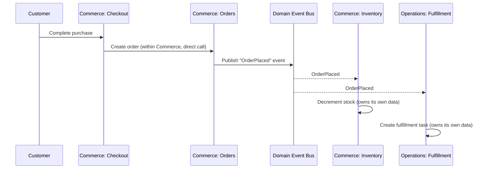

# Cross-Domain Communication Flow

Referenced by `03_SYSTEM_ARCHITECTURE.md` § Cross-Domain Communication (`ARCH:CROSS_DOMAIN_COMMUNICATION`).

Illustrative example: a customer places an order, and Inventory (Commerce) and Fulfillment (Operations) both need to react, without either domain reaching into the other's data directly.

Within a domain, direct calls are permitted (Checkout calling Orders — both Commerce). Across domains, only events are used. No domain queries or writes another domain's underlying data store directly — this is the mechanism satisfying `PRINCIPLES:SINGLE_SOURCE_OF_TRUTH`.
