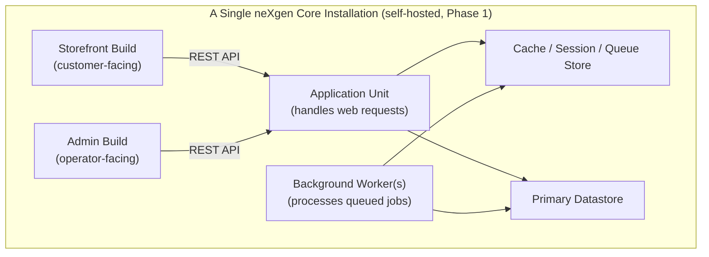

# Conceptual Deployment Topology

Referenced by `03_SYSTEM_ARCHITECTURE.md` § Deployment Topology (`ARCH:DEPLOYMENT_TOPOLOGY`).

Shape only — no orchestration tooling or infrastructure-as-code specifics. Those belong in `11_DEPLOYMENT_STANDARD.md`.

The Application Unit and Background Worker(s) are stateless and can be run as multiple instances if the merchant's scale requires it, since all shared state lives in the Cache/Session/Queue store and the Datastore — this is what makes the system horizontally scalable per `ARCH:NFR`. A single-installation deployment is one tenant; the same shape supports a future multi-tenant deployment without structural change, per `ARCH_PLAN:RESOLVED_DECISIONS` item 1.
