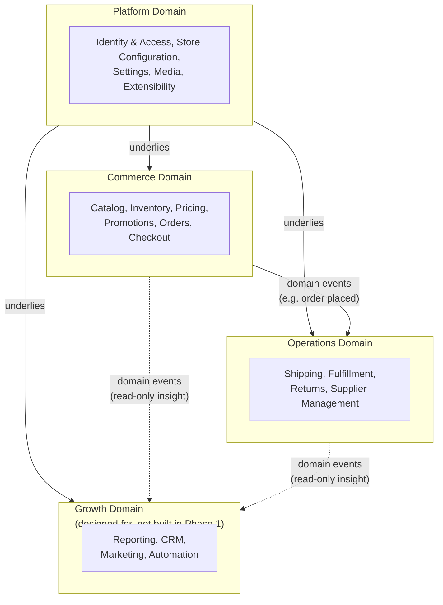

# Domain Map

Referenced by `03_SYSTEM_ARCHITECTURE.md` § Domain Map (`ARCH:DOMAIN_MAP`).

Domains only — no modules, no tables, no endpoints. Module-level detail belongs in `04_MODULE_ARCHITECTURE.md`.

Platform is the only domain every other domain depends on directly. Commerce and Operations communicate through domain events, not direct calls into each other's data. Growth consumes events from Commerce and Operations but is not depended upon by either — consistent with it being designed-for, not built, in Phase 1.
