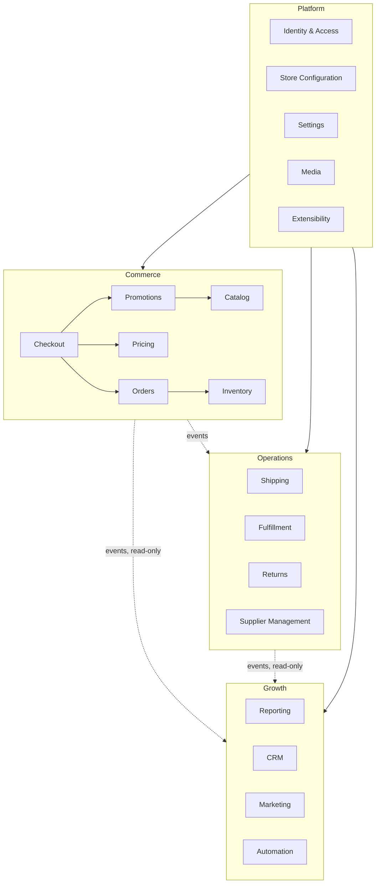

# Module Dependency Map

Referenced by `04_MODULE_ARCHITECTURE.md` § Cross-Module Interaction Rules (`MODULE:INTERACTION_RULES`).

Solid arrows = allowed direct dependency (same domain, or any module depending on Platform). Dashed arrows = cross-domain, event-only interaction (`ARCH:CROSS_DOMAIN_COMMUNICATION`). No arrow = no dependency permitted.

Within-domain arrows shown are illustrative, not exhaustive — the binding rule is stated in `MODULE:COUPLING_RULES`, not this diagram. Growth has no outgoing arrows into Commerce or Operations: it is never depended upon by either, consistent with `ARCH:DOMAIN_MAP`.
