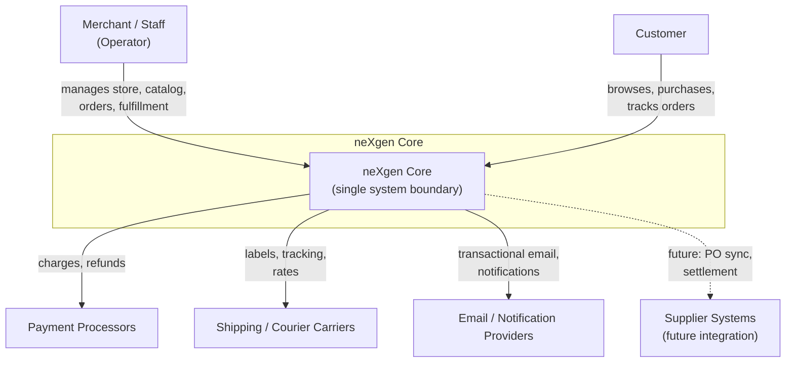

# System Context Diagram

Referenced by `03_SYSTEM_ARCHITECTURE.md` § System Context (`ARCH:SYSTEM_CONTEXT`).

No internal structure is shown here — the system is a single box. Internal domain structure is defined in the Domain Map diagram.
