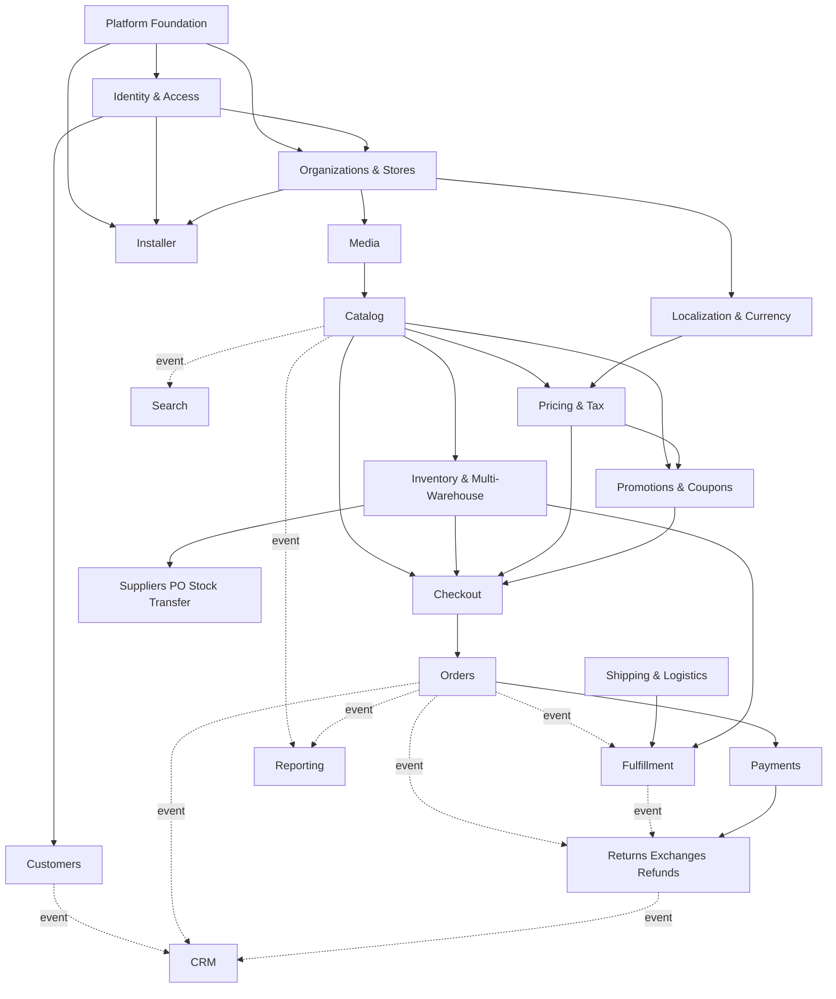

# Implementation Master Plan — Module Dependency Diagram

Referenced by `IMPLEMENTATION_MASTER_PLAN.md` Part 3.

Solid arrows are direct same-domain dependencies or explicit build-order prerequisites. Dashed arrows are event-based cross-domain reactions, per `ARCH:CROSS_DOMAIN_COMMUNICATION` — the receiving module is never blocked waiting on the publisher, and never depended upon in reverse.

Not shown for clarity: Content & Discovery, Communication, and Platform Interface modules, all of which depend on Catalog/Orders/Customers existing first but do not participate in Commerce's core transaction path.
